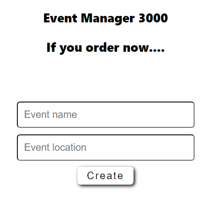
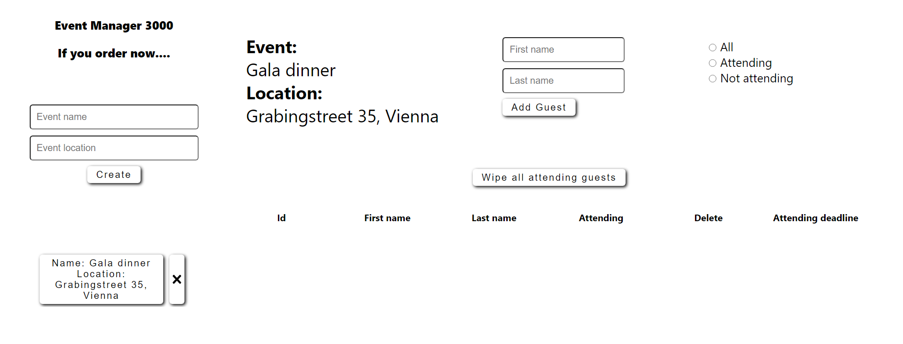
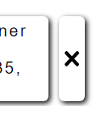
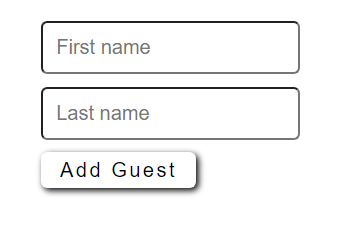
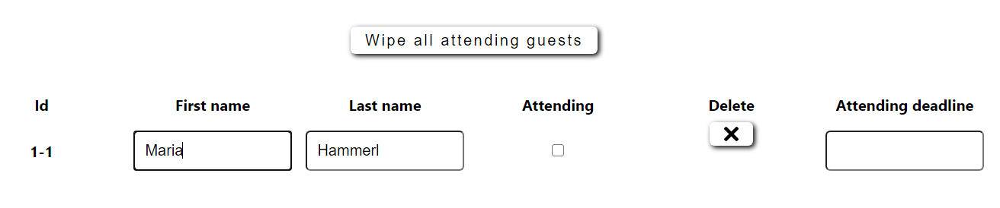
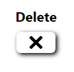
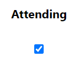
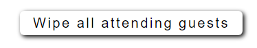
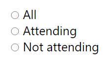
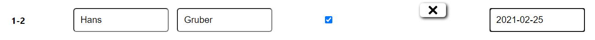

# Event Manager 3000 .... if you order now

This project let's administer your events and the corresponding guest list. This react project is based on an express api which can be found here:

[Express server repo](uebriges/express-server-for-react-guestlist).

## Functionality overview

- Creating new events 🆕
- Deleting events ❌
- Adding new guests to an event 🚀
- Edit first and last name of every guest 🍀
- Delete a single guest ❌
- Mark a guest as attending ✔
- Delete all attending guests ❌
- Filter by attending/not attending 🚳
- Setting an attending deadline ⌚

## Creating new events

Before you can start you have to create at least one event in the Sidebar on the left side:  

As soon as you created an event, the event is shown in the sidebar below the functionality for creating new events. After creation the empty guest list of that event is shown. You can later also chose another event if you click on on the event in the sidebar.   

In the event area you can find all the functionalities available. Those will be described in the following chapters.

## Deleting events

You can delete events by simply clicking on he button with the x symbol right to the event button.

## Adding new guests to an event

You can add new guests by first filling out the first and last name input field in the guest list header of the event. You can either click the Add guest button or simply press Enter to create a new guest.

## Edit first and last name of every guest

By double clicking the first or the last name of a guest entry in the guest list, you can edit the names. After you edited the name simply press enter. The changes will be saved and the input field is not changeable anymore.

For multiple changes simply repeat the instructions from above.

## Delete a single guest

By clicking on the delete button with the x symbol in the guest list, you can delete a single guest.

## Mark a guest as attending

By cicking the checkbox in the column Attending, you can mark a single guest as attending.

## Delete all attending guests

All guests that are marked as attending, can be deleted at once by the "Wipe all attending guests" button.

## Filter by attending/not attending

You can filter the list of guests of an event by clicking on one of the radio buttons in the guest list header on the right side.

## Setting an attending deadline

You can set a guest an attendin deadline. For editing, you can again use double click. By setting a guests attending deadline for the same day or a date in the future, the attending checkbox will be checked automatically.

If you chose a date in the past. The checkbox will be unchecked.

